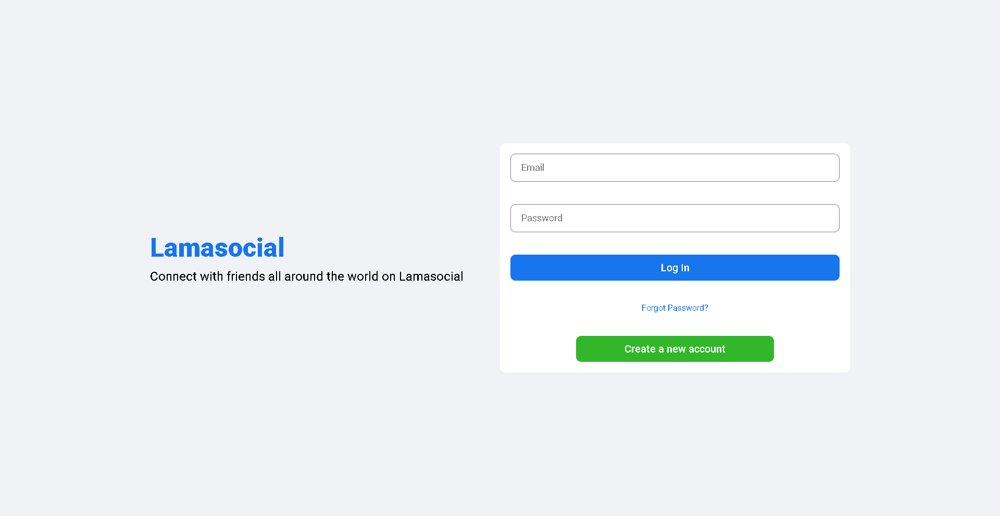
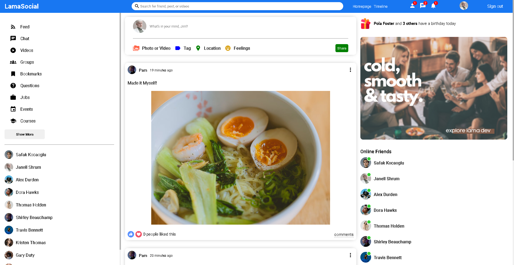
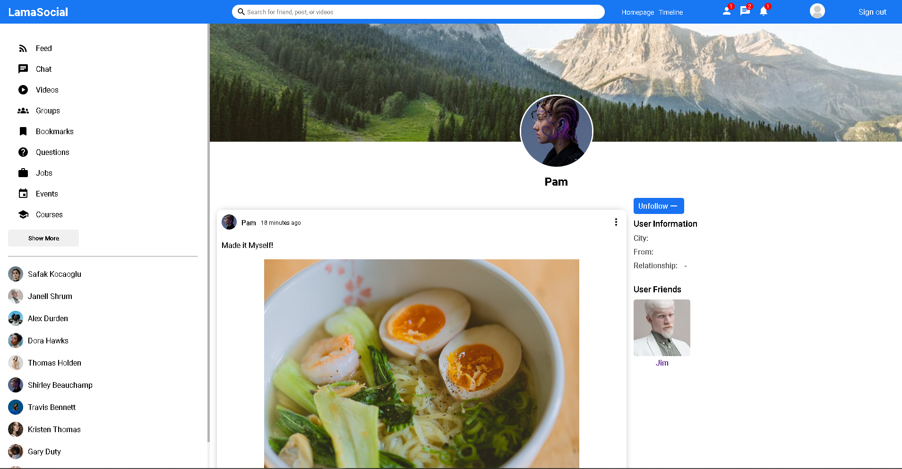

# 🚀 MERN Stack Social Media Application

A modern, full-stack social media application showcasing advanced web development techniques using the MERN (MongoDB, Express, React, Node.js) stack.

## System Overview

### Login Page

   

### Register Page

   

### Timeline

   

### Profile Page

   

## ✨ Key Features

- 🔐 User Authentication (Register, Login, Logout)
- 👤 Profile Management (Update, Delete)
- 📝 Post Handling (Create, Update, Like, Dislike)
- 🔗 Follow/Unfollow Functionality
- 📅 Dynamic Timeline and News Feed
- 🖼️ Image Upload and Sharing
- 📱 Responsive Design

## 🛠️ Tech Stack

### Backend
- **Node.js** - JavaScript runtime
- **Express** - Web application framework
- **MongoDB** - NoSQL database for data storage and authentication
- **Mongoose** - MongoDB object modeling tool
- **Bcrypt** - Password hashing
- **Multer** - Handling multipart/form-data for file uploads

### Frontend
- **React** - UI library
- **React Router** - Navigation and routing
- **Context API** - State management
- **Axios** - HTTP client for API requests
- **Material-UI** - React component library for faster UI development

### Development & Testing
- **Postman** - API testing and development
- **Nodemon** - Auto-reloading during development
- **Concurrently** - Running backend and frontend simultaneously

## 🌟 Key Implementations

- RESTful API architecture
- MongoDB-based user authentication system
- CRUD operations for posts and user profiles
- Efficient state management using Context API and reducers
- Dynamic data fetching and rendering
- Responsive and intuitive UI design
- Image upload functionality with preview

## 🔮 Future Enhancements

- 💬 Real-time chat application
- 🔔 Push notifications
- 🔒 Enhanced error handling and security features

## 🚀 Setup and Installation

1. Clone the repository
2. Install dependencies: `npm install` in root and client directories
3. Set up MongoDB database
4. Configure environment variables
5. Run the application: `npm run dev` in root directory

## 🧪 Testing

API endpoints can be tested using Postman. A Postman collection is included in the repository.

## 🤝 Contributing

Contributions are welcome! Please feel free to submit a Pull Request.
